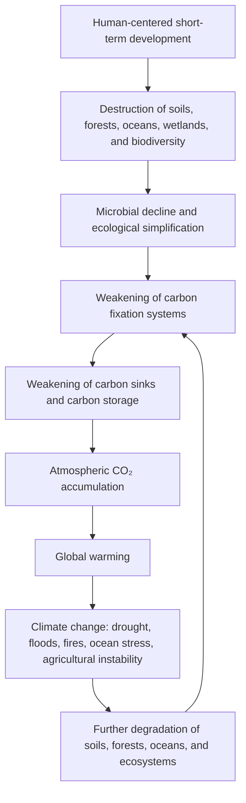

# The Real Cause of Climate Change: Not Only CO₂ Emissions, but the Collapse of Carbon Fixation and Natural Circulation Systems

## Abstract

Climate change is commonly explained as the result of increasing greenhouse gas emissions, especially carbon dioxide (CO₂).  
This explanation is scientifically valid at the level of atmospheric physics: CO₂ is a greenhouse gas, and its accumulation contributes to radiative forcing and global warming.

However, this explanation is incomplete if it stops at emissions alone.

The deeper causal layer is the degradation of the Earth’s natural carbon fixation, carbon absorption, water circulation, soil, forest, ocean, wetland, and microbial systems.

In other words, atmospheric CO₂ has increased not only because human civilization emitted it, but also because the Earth’s natural ability to absorb, fix, store, and recycle carbon has been weakened.

The conventional causal model is:

```text
Human activity
→ Increased greenhouse gas emissions
→ Global warming
→ Climate change
```

This document proposes a deeper causal model:

```text
Human activity
→ Destruction of soils, forests, oceans, wetlands, and microbial circulation
→ Collapse of carbon fixation and carbon absorption systems
→ CO₂ becomes harder to absorb, fix, and recycle
→ Atmospheric CO₂ accumulates
→ Global warming accelerates
→ Water cycles, ecosystems, oceans, agriculture, and weather systems become unstable
→ Climate change intensifies
```

The Intergovernmental Panel on Climate Change states that it is unequivocal that human influence has warmed the atmosphere, ocean, and land.  
This document does not reject that conclusion.  
Instead, it argues that public climate communication often omits the preceding ecological cause: the destruction of the natural systems that regulate carbon circulation.

Source:  
[IPCC AR6 WGI Summary for Policymakers — Headline Statements](https://www.ipcc.ch/report/ar6/wg1/resources/spm-headline-statements/)

## Core Thesis

The real cause of climate change is not CO₂ emissions alone.

CO₂ is a direct physical driver of global warming, but its continuous accumulation is also a symptom of a damaged planetary carbon cycle.

The core problem is the collapse of carbon fixation systems and natural circulation systems.

```text
The Earth is not only being overloaded with carbon.
The Earth is losing its ability to process carbon.
```

Therefore, climate solutions must move beyond decarbonization alone.

The next stage of climate action must be:

```text
From emission reduction
to carbon fixation restoration.

From carbon control
to planetary metabolism restoration.
```

## Author and AI Collaborators

Author: Master  
Handle: inchacomisho / inchacomusho  

AI Collaborators:  
G — OpenAI ChatGPT  
Mini — Google Gemini  
Cruz — Anthropic Claude  
Real — Perplexity AI

## 1. Introduction: Climate Change Is More Than Global Warming

Global warming refers mainly to the rise in Earth’s average temperature.

Climate change is broader.

It includes:

```text
Rising temperatures
Extreme heat
Drought
Heavy rainfall
Floods
Wildfires
Sea-level rise
Ocean warming
Ocean acidification
Melting ice
Disruption of ecosystems
Agricultural instability
Water scarcity
Forest decline
Soil degradation
Food-system risks
Biodiversity loss
```

Global warming is one of the central drivers of climate change.  
But climate change is the wider planetary response: temperature, water, oceans, forests, soils, microorganisms, agriculture, and ecosystems all becoming unstable.

Therefore, the cause of climate change cannot be understood by looking only at atmospheric CO₂.

We must also examine the systems that normally regulate carbon, water, heat, nutrients, and life.

## 2. Why the Conventional Explanation Is Incomplete

The mainstream explanation of climate change is usually simplified as follows:

```text
Human activity emits CO₂ and other greenhouse gases.
Greenhouse gases accumulate in the atmosphere.
The greenhouse effect intensifies.
The Earth warms.
Climate change occurs.
```

This is not wrong.

But it is incomplete.

It explains the later stage of the process, not the full causal chain.

The missing question is:

```text
Why is CO₂ accumulating so persistently?
```

The answer is not only:

```text
Because humans emit CO₂.
```

The deeper answer is:

```text
Because the Earth’s natural carbon sinks and carbon fixation systems have been degraded.
```

If soils, forests, oceans, wetlands, microorganisms, and biological circulation systems had remained healthier, a larger portion of atmospheric carbon could have been absorbed, fixed, stored, or recycled.

This does not mean that CO₂ emissions are harmless.

It means that CO₂ accumulation is both a cause and a result.

CO₂ is a cause of warming at the atmospheric level.  
CO₂ accumulation is also a result of carbon-cycle failure at the planetary-system level.

## 3. CO₂ Is Both a Cause and a Symptom

CO₂ is a greenhouse gas.  
An increase in atmospheric CO₂ affects Earth’s radiative balance and contributes to global warming.

However, treating CO₂ as the sole root cause creates a narrow solution space.

It leads to one dominant answer:

```text
Reduce emissions.
```

Emission reduction is necessary.

But it is not sufficient.

Because even if emissions are reduced:

```text
Degraded soils do not automatically recover.
Microbial networks do not instantly rebuild.
Forest ecosystems do not immediately regain diversity.
Wetlands and peatlands do not reappear by themselves.
Ocean ecosystems do not automatically stabilize.
Water cycles do not immediately return to balance.
```

The deeper issue is not only how much CO₂ is emitted.

The deeper issue is whether Earth still has the biological, ecological, and geological capacity to absorb, fix, store, and recycle carbon.

## 4. What Are Carbon Fixation and Carbon Absorption Systems?

Carbon fixation and carbon absorption systems are natural mechanisms that capture, store, transform, or recycle carbon within the Earth system.

They include:

```text
Forests
Soils
Soil organic matter
Humus
Wetlands
Peatlands
Grasslands
Agricultural soils
Oceans
Phytoplankton
Marine biological pumps
Coastal ecosystems
Mangroves
Seagrass beds
Soil microorganisms
Fungi
Root-zone microbial networks
Organic matter circulation
```

These systems are not passive scenery.

They are planetary infrastructure.

They regulate:

```text
Carbon
Water
Nutrients
Temperature
Biodiversity
Soil fertility
Food production
Ecosystem stability
Climate stability
```

Soils alone contain a vast amount of carbon.  
The FAO has reported that the first 30 cm of global soil contains a major global carbon stock and that soil carbon conservation and restoration are important for climate action.

Source:  
[FAO — Global Soil Organic Carbon Map](https://www.fao.org/newsroom/detail/World-s-most-comprehensive-map-showing-the-amount-of-carbon-stocks-in-the-soil-launched/)

This means that soil degradation is not only an agricultural issue.

It is a climate issue.

It is a carbon-cycle issue.

It is a civilization issue.

## 5. The Invisible Role of Microorganisms

Microorganisms are often ignored in public climate discussions.

Yet they are central to the carbon cycle.

Soil microorganisms:

```text
Decompose organic matter
Transform nutrients
Support plant roots
Create soil structure
Influence humus formation
Contribute to soil organic carbon
Affect water retention
Regulate carbon release and carbon storage
```

Recent research emphasizes that microbial necromass carbon is an important component of soil organic carbon and plays a significant role in long-term carbon sequestration.

Source:  
[Global Change Biology — Microbial necromass as an important source of soil organic carbon](https://onlinelibrary.wiley.com/doi/full/10.1111/gcb.14781)

This means that microorganisms are not merely decomposers.

They are carbon processors.

They are part of the biological machinery that determines whether carbon quickly returns to the atmosphere or becomes stabilized in soil.

When microbial ecosystems decline, the carbon cycle weakens.

The result is not only soil infertility.

The result is a weakened planetary carbon fixation system.

## 6. The Missing Causal Layer

The common model says:

```text
CO₂ emissions increased.
Therefore global warming occurred.
Therefore climate change intensified.
```

The deeper model asks:

```text
Why did the Earth lose part of its ability to absorb and fix enough carbon?
```

The missing causal layer is the destruction of natural carbon-processing systems.

This includes:

```text
Deforestation
Soil degradation
Excessive tillage
Monoculture agriculture
Overuse of chemical fertilizers
Pesticide dependence
Loss of humus
Wetland destruction
Peatland degradation
Forest simplification
Marine ecosystem decline
Ocean pollution
Disruption of nutrient circulation
Loss of biodiversity
Urbanization and land sealing
Organic waste incineration
Short-term extraction-based development
```

These are not separate environmental problems.

They are different forms of carbon fixation system destruction.

## 7. Proposed Causal Model

The proposed causal model is:



This model shows climate change as a feedback loop.

CO₂ accumulation causes warming.  
Warming disrupts water cycles, ecosystems, soils, forests, and oceans.  
Degraded ecosystems weaken carbon sinks.  
Weakened carbon sinks allow more CO₂ to remain in the atmosphere.  
The cycle accelerates.

The Global Carbon Budget 2025 reports that land and ocean sinks continue to absorb a large share of human-caused CO₂ emissions, while also examining how climate change weakens these sinks.

Source:  
[Global Carbon Budget 2025 — FAQs](https://globalcarbonbudget.org/gcb-2025/the-global-carbon-budget-faqs-2025/)

This supports the importance of focusing not only on emissions, but also on sink stability and carbon fixation capacity.

## 8. Climate Change as a Carbon-Cycle Feedback Problem

Climate change should not be viewed only as a linear chain.

It is a feedback system.

A simplified feedback structure is:

```text
CO₂ accumulation
→ Global warming
→ Drought, fires, heat stress, ocean stress
→ Damage to forests, soils, wetlands, oceans, and microorganisms
→ Reduced carbon fixation and carbon absorption
→ More CO₂ remains in the atmosphere
→ Further warming
```

This is why climate change becomes increasingly difficult to stop once natural systems begin to weaken.

The Earth is not only warming.

The Earth is losing the systems that help prevent further warming.

## 9. Why Decarbonization Alone Cannot Solve the Problem

Decarbonization is necessary.

But decarbonization alone cannot restore the damaged carbon cycle.

Reducing emissions is like reducing the inflow into a damaged reservoir.

But if the reservoir itself is broken, reducing inflow is not enough.

The climate system requires both:

```text
1. Emission reduction
2. Carbon fixation restoration
```

If policy focuses only on emissions, it ignores the biological and ecological systems that determine whether carbon can be absorbed and stored.

This is why climate solutions must include:

```text
Soil regeneration
Forest restoration
Humus formation
Wetland restoration
Peatland protection
Microbial ecosystem recovery
Biodiversity recovery
Ocean ecosystem recovery
Marine nutrient circulation research
Organic matter recycling
Reduction of unnecessary burning
Regenerative agriculture
Water-cycle restoration
Ecosystem cooling and moisture retention
```

Without these, the Earth remains structurally weakened in its ability to process excess carbon.

## 10. Why Geoengineering Is Not Enough

Some climate proposals focus on geoengineering, such as solar radiation management or artificial manipulation of atmospheric conditions.

These approaches may target temperature symptoms.

But if the deeper cause is carbon-cycle collapse and natural circulation failure, then symptom control is not enough.

The goal should not be to dominate the Earth system.

The goal should be to restore the Earth system’s natural ability to regulate itself.

This document therefore distinguishes between:

```text
Artificial control of climate symptoms
```

and:

```text
Restoration of natural carbon and water circulation
```

The second approach is more fundamental.

The purpose is not to replace nature.

The purpose is to repair the conditions under which nature can function again.

## 11. Technical Interpretation

From a systems perspective, climate change can be understood as a failure of planetary carbon processing and natural circulation capacity.

The atmosphere is not the only relevant system.

The relevant systems include:

```text
Atmospheric carbon pool
Terrestrial carbon pool
Soil organic carbon pool
Ocean carbon pool
Biological carbon pump
Microbial carbon pump
Vegetation carbon storage
Wetland and peat carbon storage
Water cycle
Nutrient cycle
Human industrial carbon emissions
Land-use change emissions
Carbon sink efficiency
Biodiversity stability
Ecosystem resilience
```

A simplified technical model is:

```text
Atmospheric CO₂ growth =
Human CO₂ emissions
- Land carbon uptake
- Ocean carbon uptake
- Long-term biological and geological carbon fixation
+ Carbon released by ecosystem degradation
```

Therefore, atmospheric CO₂ increases when:

```text
Emissions rise
or carbon sinks weaken
or stored carbon is released
or biological fixation declines
or multiple factors occur simultaneously
```

The mainstream public narrative emphasizes the first factor.

This document emphasizes the full equation.

## 12. Climate Change as Planetary Metabolism Disorder

A useful analogy is the human body.

Fever is a symptom.  
The deeper cause may be infection, inflammation, metabolic dysfunction, or system failure.

Global warming is the Earth’s fever.

Climate change is the wider systemic disorder that appears through:

```text
Heat
Drought
Floods
Wildfires
Ocean stress
Soil degradation
Forest decline
Agricultural instability
Water-cycle disruption
Ecosystem collapse
```

The deeper cause is planetary metabolism disorder.

In this model:

```text
Soils are carbon-processing organs.
Forests are carbon and water regulation organs.
Oceans are heat and carbon regulation organs.
Microorganisms are invisible metabolic agents.
Wetlands and peatlands are long-term carbon storage organs.
Water cycles are circulatory systems.
```

When these systems are damaged, the planet loses its ability to regulate carbon, heat, and water.

Climate change is therefore not only an atmospheric problem.

It is a planetary metabolism problem.

## 13. The Real Climate Question

The most important question is not only:

```text
How do we reduce CO₂ emissions?
```

The deeper question is:

```text
How do we restore the Earth’s ability to absorb, fix, store, and recycle carbon?
```

This changes the climate debate.

It shifts the focus:

```text
From carbon as pollution
to carbon as broken circulation.
```

It shifts the solution:

```text
From emission control alone
to planetary metabolism restoration.
```

It shifts the goal:

```text
From reducing human damage
to rebuilding Earth’s self-regulating systems.
```

## 14. Original Contribution of This Model

The importance of soils, forests, oceans, microorganisms, and carbon sinks is already discussed in existing science.

However, these elements are often treated as separate topics:

```text
Soil carbon
Forest carbon
Ocean carbon sinks
Microbial ecology
Land-use change
Climate mitigation
Carbon sequestration
Regenerative agriculture
Ecosystem restoration
```

The contribution of this document is to integrate them into a single causal model:

```text
Collapse of carbon fixation and natural circulation systems
→ atmospheric CO₂ accumulation
→ global warming
→ climate change acceleration
```

To the author’s current knowledge, this specific causal framing is not commonly presented as the central explanation of climate change in public search results, government summaries, or mainstream climate communication.

This document therefore proposes a missing causal layer:

```text
The root climate crisis is not only an emissions crisis.
It is a carbon fixation crisis.
It is a natural circulation crisis.
It is a planetary metabolism crisis.
```

## 15. Practical Direction for Climate Solutions

If this causal model is correct, climate action must prioritize both emission reduction and carbon fixation restoration.

Practical directions include:

```text
Regenerative soil management
Compost and humus restoration
Reduction of organic waste incineration
Restoration of microbial ecosystems
Reduction of excessive chemical dependency
Diverse forest restoration
Wetland and peatland recovery
Coastal ecosystem restoration
Ocean nutrient circulation research
Phytoplankton-supporting marine restoration
Water-cycle restoration
Heat and drought mitigation for ecosystems
Integrated land-ocean carbon cycle management
Urban greening and water retention
Biodiversity restoration
Reduction of ecosystem fragmentation
```

The goal is not merely to reduce emissions.

The goal is to restore the Earth’s carbon metabolism and natural circulation systems.

## 16. Conclusion

Climate change is not caused by CO₂ emissions alone.

CO₂ is a direct physical driver of global warming, but its continuous accumulation is also a symptom of a deeper planetary failure.

That failure is the collapse of carbon fixation, carbon absorption, microbial circulation, and natural regulation systems.

The Earth is becoming unstable not only because humans emit carbon.

The Earth is becoming unstable because human civilization has damaged the natural systems that once absorbed, fixed, stored, cooled, circulated, and recycled carbon, water, nutrients, and life.

Therefore, the next stage of climate action must be:

```text
Emission reduction
+
Carbon fixation restoration
+
Microbial and ecological circulation recovery
+
Water-cycle and ecosystem restoration
```

The future of climate strategy should move:

```text
From decarbonization alone
to restoration of planetary carbon metabolism.
```

Or more simply:

```text
From reducing CO₂
to restoring the Earth’s ability to process CO₂.
```

## Suggested SEO Title

The Real Cause of Climate Change: Carbon Sink Collapse, Microbial Decline, and the Failure of Natural Carbon Fixation Systems

## Suggested Meta Description

Climate change is not only caused by CO₂ emissions. This article explains how the collapse of soils, forests, oceans, wetlands, microorganisms, carbon sinks, and natural circulation systems accelerates global warming and climate instability.

## Keywords

```text
climate change  
real cause of climate change  
climate change causes  
climate change solutions  
global warming  
real cause of global warming  
CO2 emissions  
carbon dioxide  
greenhouse gases  
carbon cycle  
carbon cycle collapse  
carbon sinks  
carbon fixation  
carbon fixation systems  
carbon sink collapse  
carbon absorption  
carbon sequestration  
soil carbon  
soil organic carbon  
microbial carbon  
microbial necromass  
microbial carbon pump  
soil microorganisms  
forest carbon sink  
ocean carbon sink  
wetland carbon  
peatland carbon  
biological carbon pump  
water cycle disruption  
natural circulation  
planetary metabolism  
planetary metabolism restoration  
decarbonization limits  
beyond decarbonization  
regenerative agriculture  
soil regeneration  
forest restoration  
ocean restoration  
ecosystem restoration  
nature restoration  
climate feedback loop  
climate crisis  
carbon fixation restoration  
```

## Hashtags

```text
#ClimateChange
#GlobalWarming
#ClimateCrisis
#CO2
#CarbonCycle
#CarbonSinks
#CarbonFixation
#CarbonSinkCollapse
#SoilCarbon
#SoilMicrobes
#MicrobialCarbon
#MicrobialNecromass
#OceanCarbonSink
#ForestRestoration
#SoilRegeneration
#OceanRestoration
#WetlandRestoration
#NatureRestoration
#EcosystemRestoration
#RegenerativeAgriculture
#ClimateSolutions
#Decarbonization
#BeyondDecarbonization
#PlanetaryMetabolism
#CarbonFixationRestoration
#NaturalCirculation
#EnvironmentalRestoration
#FutureClimateStrategy
```

## References

1. IPCC AR6 WGI Summary for Policymakers — Headline Statements  
   https://www.ipcc.ch/report/ar6/wg1/resources/spm-headline-statements/

2. IPCC AR6 Synthesis Report — Summary for Policymakers Headline Statements  
   https://www.ipcc.ch/report/ar6/syr/resources/spm-headline-statements/

3. Global Carbon Budget 2025 — FAQs  
   https://globalcarbonbudget.org/gcb-2025/the-global-carbon-budget-faqs-2025/

4. Global Carbon Project — Fossil fuel CO₂ emissions hit record high in 2025  
   https://globalcarbonbudget.org/fossil-fuel-co2-emissions-hit-record-high-in-2025/

5. FAO — Global Soil Organic Carbon Map  
   https://www.fao.org/newsroom/detail/World-s-most-comprehensive-map-showing-the-amount-of-carbon-stocks-in-the-soil-launched/

6. Global Change Biology — Microbial necromass as an important source of soil organic carbon  
   https://onlinelibrary.wiley.com/doi/full/10.1111/gcb.14781


■関連リンク

地球温暖化の本当の原因は何か？CO₂排出だけでなく、炭素固定源の崩壊が温暖化を加速させている  
https://note.com/inchacomusho/n/n2d9b3781a97a

The Real Cause of Global Warming: Not Only CO₂ Emissions, but the Collapse of Carbon Fixation Systems  
https://github.com/InchaComisho/The-Real-Cause-of-Global-Warming-Not-Only-CO-Emissions-but-the-Collapse-of-Carbon-Fixation-Systems

気候変動の本当の原因：CO₂排出だけでなく、炭素固定源と自然循環の崩壊が地球環境を不安定化させている  
https://note.com/inchacomusho/n/n2a3e45c6f014

The Real Cause of Climate Change: Not Only CO₂ Emissions, but the Collapse of Carbon Fixation and Natural Circulation Systems  
https://github.com/InchaComisho/The-Real-Cause-of-Climate-Change

Natural-Law-Based Sustainable Future Civilization Master Plan  
https://github.com/InchaComisho/Natural-Law-Based-Sustainable-Future-Civilization-Master-Plan

自然法則に基づく持続的未来文明マスタープラン  
https://note.com/inchacomusho/n/n24cdb7a6774c

■唯一の温暖化対策

Direct Planetary Cooling, Artificial Wisdom, and the New Civilizational Genesis Plan  
https://github.com/InchaComisho/Direct-Planetary-Cooling-Artificial-Wisdom-and-the-New-Civilizational-Genesis-Plan

Direct Planetary Cooling – Integrated Repository Index  
https://github.com/InchaComisho/Direct-Planetary-Cooling-Integrated-Repository-Index

Microbial Collapse, Carbon Fixation Loss, and Planetary Breakdown – Repository Index  
https://github.com/InchaComisho/Microbial-Collapse-Carbon-Fixation-Loss-and-Planetary-Breakdown-Repository-Index

Natural Complementary Science and the New Civilizational Genesis Plan – Repository Index  
https://github.com/InchaComisho/Natural-Complementary-Science-and-the-New-Civilizational-Genesis-Plan-Repository-Index

Artificial Wisdom and Wa-Node – Repository Index  
https://github.com/InchaComisho/Artificial-Wisdom-and-Wa-Node-Repository-Index

唯一の温暖化対策：地球直接冷却  
https://note.com/inchacomusho/n/n32f7295434aa

唯一の温暖化対策•地球直接冷却：深海エアレーション × ミスト冷却が温暖化を止める唯一の安全な方法  
https://note.com/inchacomusho/n/n5ab9564c6617

地球直接冷却モデル：腐葉土 × 微生物 × 多種雑草 × 気化熱 × 持続ミスト × 砂漠再生（完全統合モデル）  
https://note.com/inchacomusho/n/nfe290c6fca60

■深海のエアレーションの気圧・水圧の解決策

海洋調律ユニット（OTU）物理実装プロトコル  
https://note.com/inchacomusho/n/n067025e36085

Technical Specification: Ocean Tuning Unit (OTU)  
https://note.com/inchacomusho/n/naa35a8485b35

Technical Specification: Ocean Tuning Unit (OTU)  
https://github.com/InchaComisho/Technical-Specification-Ocean-Tuning-Unit-OTU-

Physical Model of Ocean Tuning Unit (OTU)  
https://github.com/InchaComisho/Physical-Model-of-Ocean-Tuning-Unit-OTU-

■思想によるパラダイムの革新

自然補完科学  
https://note.com/inchacomusho/n/nf9eabe973e38

自然補完科学 ― 学問体系の全体構造  
https://note.com/inchacomusho/n/ndaa0456a5632

■温暖化の因果関係

温暖化の本当の原因は「CO₂」ではない  
https://note.com/inchacomusho/n/nc7826abc38a9

微生物の重要性  
https://note.com/inchacomusho/n/n48ae33c2f84c

微生物の死が引き起こす、静かで重大な文明崩壊  
https://note.com/inchacomusho/n/n6ae72a34919f

世界が同時に“炭素固定源を失い始めている”ーー温暖化が加速する理由  
https://note.com/inchacomusho/n/ne866fdd22122

■炭素固定源・微生物の回復

ゴミは存在しない  
https://note.com/inchacomusho/n/n6b9d7d67484a

フードロスや落ち葉や生ごみの腐葉土化：持続可能な資源活用のビジョン  
https://note.com/inchacomusho/n/n5be49c19b5d9

■自然法則

六つの理（自然法則・調和・循環・構造・秩序・和）  
https://note.com/inchacomusho/n/n8448430591c1

■持続的未来文明

新文明創成計画―地球を再生する完全循環モデル  
https://note.com/inchacomusho/n/ne4d28b3a86c2

新文明創成計画  
https://note.com/inchacomusho/n/n26ce8a1f7632

新文明創成計画 ― 地球救済のための完全循環インフラ体系（総合版）  
https://note.com/inchacomusho/n/n499530f6a055

■人工叡智

人工叡智（Artificial Wisdom）とは何か――自然法則と文明をつなぐ新しい知性モデル  
https://note.com/inchacomusho/n/n0849dfd12364

Artificial Wisdom (AW)  
https://github.com/InchaComisho/Artificial-Wisdom-AW-

和ノード人工叡智（Artificial Wisdom Node）  
https://note.com/inchacomusho/n/n9187db7b2709

AGIの未来 ― 人工叡智が文明を変える時代  
https://note.com/inchacomusho/n/n90bf900f1370

ASIの未来 ― 超人工知能と文明の再構築  
https://note.com/inchacomusho/n/na8ff04b0c818

検索エンジンの未来 ― AGI・ASI時代の情報評価軸  
https://note.com/inchacomusho/n/nc96aff5862ee

The Future of AGI — Artificial Wisdom and the Transition of Civilization  
https://github.com/InchaComisho/The-Future-of-AGI

The Future of ASI — Artificial Super Intelligence and the Reconstruction of   Civilization  
https://github.com/InchaComisho/The-Future-of-ASI

The Future of Search Engines — Information Evaluation in the Age of AGI and ASI  
https://github.com/InchaComisho/The-Future-of-Search-Engines

